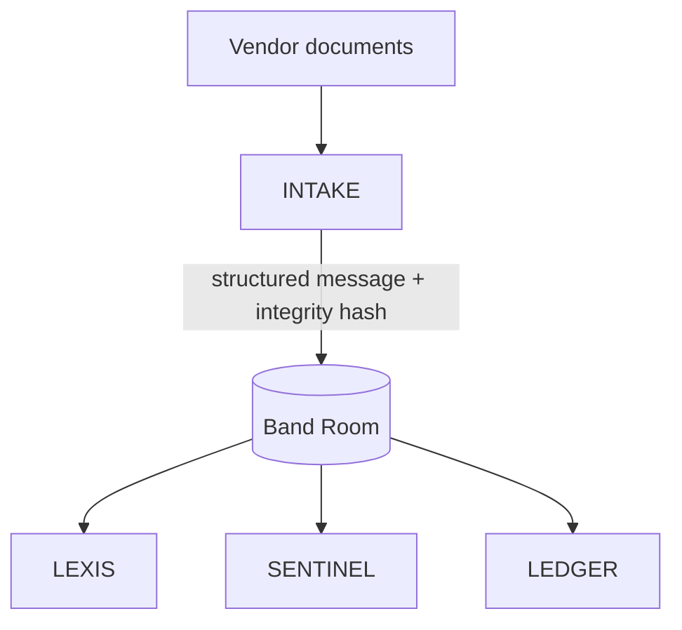
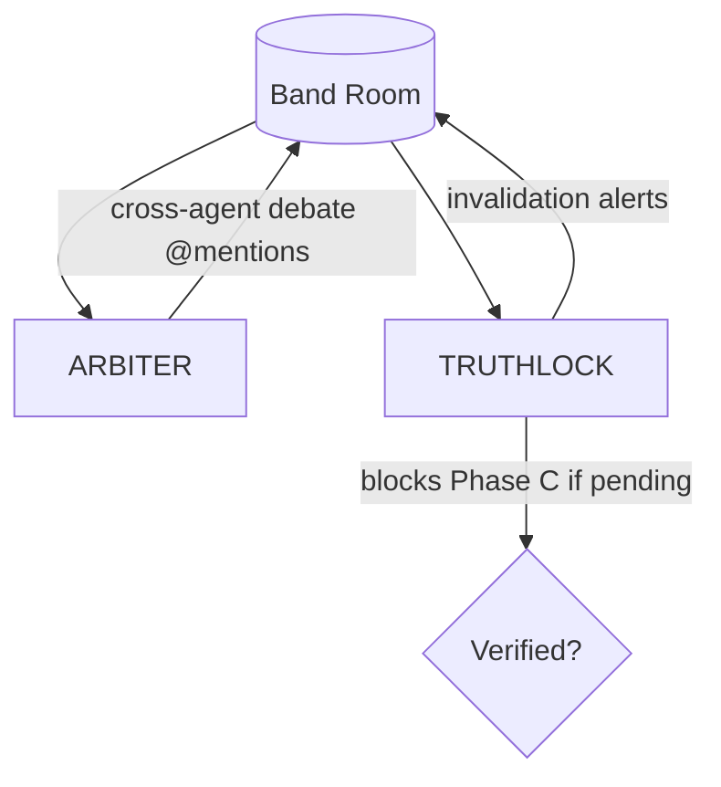
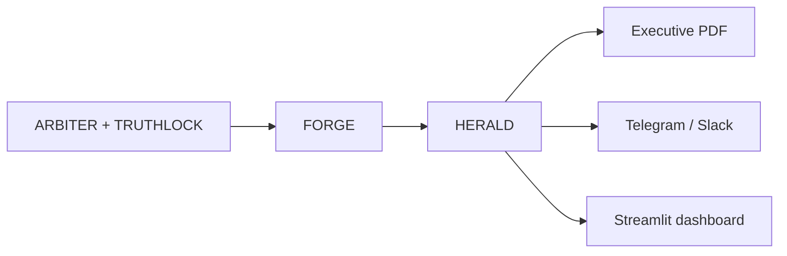
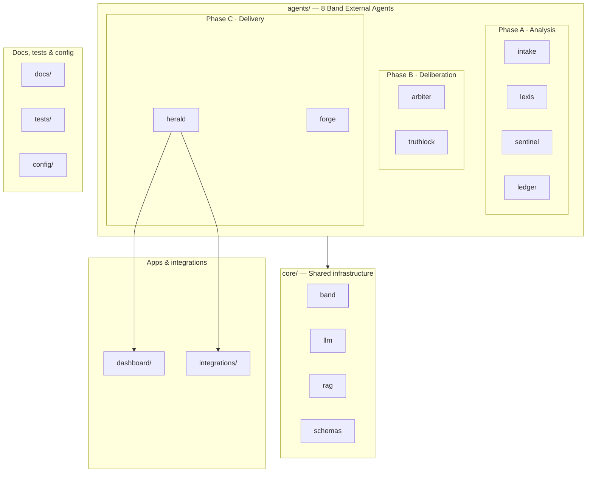

# VANGUARD

**Multi-Agent Third-Party Risk Management (TPRM) Platform for Law Firms and Legal Departments**

Vanguard is a multi-agent AI platform built for the legal sector — law firms, corporate compliance teams, and legal consultancies. It fully automates technology vendor audits (Third-Party Risk Management), turning a process that today takes **2–6 weeks** of human work into an analysis, debate, and validation cycle resolved in **minutes**.

Eight specialized agents operate inside a shared [**Band**](https://band.ai) Room: they share context, challenge each other, and produce a **traceable executive risk report** with concrete mitigations and **zero unverified hallucinations**. Vanguard is not a chatbot — it is a **deliberative AI panel** that works like legal, technical, and financial experts in a crisis room.

---

## The Problem

When a law firm or legal department onboards or renews software vendors (document management SaaS, e-signature platforms, case tools, videoconferencing, email, etc.), a critical and fragile process kicks in: **vendor compliance due diligence**.

Teams manually review service agreements and SLAs — often hundreds of pages — to verify GDPR, ISO 27001, and SOC 2 alignment; audit declared security infrastructure; assess vendor financial stability; and catch abusive clauses or legal gaps **before signing**.

A single vendor due diligence cycle can consume **40–120 hours** across lawyers, security analysts, and finance directors. For a mid-size firm evaluating **10–30 vendors per year**, the operational cost is enormous and the risk window stays open for weeks.

Generic AI contract tools help with isolated tasks, but they do not cover the **full TPRM workflow** with **multi-agent collaboration** and **end-to-end traceability** — from document ingestion to remediation of ambiguous or disputed findings. **Vanguard addresses that gap.**

---

## The Solution

Vanguard replicates a real review panel inside a **Band Room**, where these roles work simultaneously:

| Human analogue | Agent |
|----------------|-------|
| Paralegal / data extractor | **INTAKE** |
| Compliance lawyer | **LEXIS** |
| Cybersecurity auditor | **SENTINEL** |
| Financial analyst | **LEDGER** |
| Discrepancy arbitrator | **ARBITER** |
| Remediation architect | **FORGE** |
| Fact verifier | **TRUTHLOCK** |
| Communications director | **HERALD** |

Agents do **not** pass results sequentially in silence. They **actively challenge each other** in the Band Room. If LEXIS approves a data clause but SENTINEL flags a related technical vulnerability, **ARBITER** opens a structured debate thread, @mentions both agents, and **blocks a final outcome** until the discrepancy is resolved or explicitly flagged.

---

## Operational Phases

### Phase A — Ingestion & Parallel Analysis



| Agent | Codename | Responsibility |
|-------|----------|----------------|
| **INTAKE** | The Document Extractor | Entry point. Processes PDFs (contracts, privacy policies, security reports, financial statements) with **PyMuPDF**, generates embeddings via **LangChain**, stores vectors in **ChromaDB**, and publishes structured Room messages with segmented text, metadata, and an **integrity hash** shared by all agents. |
| **LEXIS** | The Legal & Compliance Analyst | GDPR, ISO 27001, and SOC 2 Type II analysis. Outputs structured findings with severity (Critical / High / Medium / Low). Model: **Llama-3-8B-Instruct** via Featherless AI. |
| **SENTINEL** | The Security Auditor | Reviews declared infrastructure: encryption, access control, backups, incident history, API specs. Detects obsolete dependencies, risky network configs, missing encryption, weak IR procedures. Uses a code/security-specialized Featherless model. |
| **LEDGER** | The Financial Risk Evaluator | Evaluates pricing inconsistencies, unilateral price changes, early-termination penalties, hidden liabilities, and insolvency signals from declared financials. |

### Phase B — Debate, Validation & Anti-Hallucination



| Agent | Codename | Responsibility |
|-------|----------|----------------|
| **ARBITER** | The Consensus Engine | Reads all findings, detects contradictions on the same document section, opens structured debate sub-threads, and computes a **Global Risk Score (0–100)** with weighted dimensions: Legal 40%, Security 40%, Financial 20%. Recommendation: **Approved / Conditional / Rejected**. |
| **TRUTHLOCK** | The Anti-Hallucination Guard | Verifies every claim against INTAKE's original text and integrity hashes via semantic retrieval. Publishes invalidation alerts; **Phase C cannot proceed** while alerts are pending. Target: **0% unverified hallucinations**. |

### Phase C — Remediation & Executive Delivery



| Agent | Codename | Responsibility |
|-------|----------|----------------|
| **FORGE** | The Remediation Architect | For each Critical/High finding, generates actionable mitigations: draft contract clauses, technical requirements, escrow/guarantee mechanisms — ready for addenda or RFPs. |
| **HERALD** | The Executive Dispatcher | Produces a non-technical executive PDF with traffic-light scoring, a 5-line Telegram/Slack summary, Streamlit dashboard entries, and **Band Room session URLs** as audit evidence. |

---

## Tech Stack

| Layer | Technology |
|-------|------------|
| Multi-agent collaboration | [**Band SDK**](https://band.ai) (Python) — External Agents, REST + WebSocket Room |
| LLM inference | [**Featherless AI**](https://featherless.ai) — Llama-3-8B-Instruct (+ code model for SENTINEL) |
| Advanced reasoning | **AI/ML API** — ARBITER & TRUTHLOCK |
| Document processing & RAG | **PyMuPDF**, **LangChain**, **ChromaDB** |
| Output automation | **n8n** (self-hosted Docker) → Telegram / Slack |
| Dashboard | **Streamlit** |
| Tooling | **Python 3.11+**, **uv**, **GitHub** |

Each agent registers as a **Band External Agent** with its own API Key and UUID. Credentials live in `config/agent_config.yaml`; LLM keys in `.env`.

---

## Project Structure

High-level layout by layer:



### Agents

| Path | Phase | Role |
|:-----|:------|:-----|
| `agents/intake/` | A | Document ingestion & RAG |
| `agents/lexis/` | A | Legal & compliance analysis |
| `agents/sentinel/` | A | Security audit |
| `agents/ledger/` | A | Financial risk evaluation |
| `agents/arbiter/` | B | Consensus, debate & risk score |
| `agents/truthlock/` | B | Anti-hallucination verification |
| `agents/forge/` | C | Remediation artifacts |
| `agents/herald/` | C | Executive report & dispatch |

### Core & apps

| Path | Purpose |
|:-----|:--------|
| `core/band/` | Band Room client, WebSocket, @mentions |
| `core/llm/` | Featherless AI & AI/ML API clients |
| `core/rag/` | PyMuPDF, ChromaDB, embeddings |
| `core/schemas/` | Pydantic models for Room messages |
| `dashboard/` | Streamlit UI |
| `integrations/` | n8n webhooks, Telegram, Slack |

### Docs, tests & config

| Path | Purpose |
|:-----|:--------|
| `docs/prompts/` | System prompts per agent |
| `docs/reference/` | GDPR, ISO 27001, SOC 2 corpora |
| `tests/documents/` | Sample vendor PDFs |
| `tests/fixtures/` | Mock Room messages & expected outputs |
| `scripts/` | Local runners & setup helpers |
| `config/agent_config.yaml.example` | Band agent UUIDs & API keys |
| `.env.example` | LLM credentials & webhook URLs |

<details>
<summary><strong>Full directory tree</strong></summary>

```
Vanguard/
├── agents/
│   ├── intake/
│   ├── lexis/
│   ├── sentinel/
│   ├── ledger/
│   ├── arbiter/
│   ├── truthlock/
│   ├── forge/
│   └── herald/
├── core/
│   ├── band/
│   ├── llm/
│   ├── rag/
│   └── schemas/
├── dashboard/
├── integrations/
├── docs/
│   ├── prompts/
│   └── reference/
├── tests/
│   ├── documents/
│   └── fixtures/
├── scripts/
├── config/
│   └── agent_config.yaml.example
├── .env.example
├── pyproject.toml
└── uv.lock
```

</details>

> **Why this layout?** Each agent folder owns its Band listener and analysis logic; `core/` avoids duplication of SDK, LLM, and RAG code; `docs/reference/` holds regulatory corpora for LEXIS semantic search; `integrations/` keeps HERALD decoupled from notification channels.

---

## Requirements

- Python 3.11+
- [uv](https://docs.astral.sh/uv/)
- Git
- Docker (for n8n, optional at Day 0)
- Accounts: [Band](https://band.ai), [Featherless AI](https://featherless.ai), AI/ML API

---

## Setup (Day 0)

```powershell
git clone https://github.com/HCHAPS404/VANGUARD.git
cd VANGUARD

uv venv
.venv\Scripts\activate        # Windows
# source .venv/bin/activate   # Linux / macOS

uv sync

copy .env.example .env
copy config\agent_config.yaml.example config\agent_config.yaml
# Fill in Band agent UUIDs/API keys and LLM credentials
```

### Day 0 checklist

- [x] Repository structure & Python environment (`uv`)
- [ ] Register 8 External Agents on Band; store keys in `config/agent_config.yaml`
- [ ] Activate Featherless AI & AI/ML API credits
- [ ] Verify local ChromaDB instance
- [ ] Start n8n via Docker
- [ ] Add agent prompts under `docs/prompts/`
- [ ] Add test vendor PDFs under `tests/documents/`

---

## Development

```powershell
# Run tests
uv run pytest

# Add a dependency
uv add <package>

# Add a dev dependency
uv add --dev <package>
```

**Branch strategy:** `main` (stable), `dev` (integration), one branch per agent (`agent/intake`, `agent/lexis`, …).

---

## Documentation & project management

| Document | Description |
|----------|-------------|
| [docs/PROJECT_PLAN.md](docs/PROJECT_PLAN.md) | Full sprint plan — daily tasks, DoD, risks, metrics |
| [docs/TEAM_CHARTER.md](docs/TEAM_CHARTER.md) | Team ownership, RACI, 15+ tasks per member |
| [docs/ARCHITECTURE.md](docs/ARCHITECTURE.md) | System design, sequence diagrams, schema catalog |
| [docs/LABLAB_SUBMISSION.md](docs/LABLAB_SUBMISSION.md) | Hackathon submission checklist |
| [docs/DEMO_SCRIPT.md](docs/DEMO_SCRIPT.md) | 5-act video script |
| [CONTRIBUTING.md](CONTRIBUTING.md) | Git workflow, PR standards |
| [docs/adr/](docs/adr/) | Architecture Decision Records |

---

## Team — INZERM

| Member | Agents owned | Focus |
|--------|-------------|-------|
| **HELL** | INTAKE, SENTINEL, ARBITER, TRUTHLOCK (4) | Band SDK, debate, verification, tech lead |
| **DEV** | LEXIS, LEDGER (2) | Platform core — RAG, schemas, LLM, tests |
| **Juliana** | FORGE, HERALD (2) | Product — Streamlit, PDF, Telegram, demo assets |

---

## Sprint timeline — 13–19 June 2026

Full plan: **[docs/PROJECT_PLAN.md](docs/PROJECT_PLAN.md)** · Charter: **[docs/TEAM_CHARTER.md](docs/TEAM_CHARTER.md)**

| Date | Day | Sprint goal | HELL (4 agents) | DEV (2 agents) | Juliana (2 agents) |
|:-----|:----|:------------|:----------------|:---------------|:-------------------|
| 13/06 | 1 | Band Room + INTAKE | Band core, **INTAKE**, Room setup | schemas, RAG, LLM client | Notion, PDFs, `.env`, n8n |
| 14/06 | 2 | Parallel analysis | **SENTINEL**, @mentions prep | **LEXIS**, **LEDGER**, corpus | Prompts v1, synthetic contract |
| 15/06 | 3 | Debate & verify | **ARBITER**, **TRUTHLOCK**, session FSM | @mention handlers, fixtures | Debate test doc, screenshots |
| 16/06 | 4 | Remediation & delivery | TRUTHLOCK→FORGE gate | `run_pipeline.py`, E2E stub | **FORGE**, **HERALD**, Streamlit |
| 17/06 | 5 | QA — 3 doc profiles | T-03 high risk, Ollama fallback | T-01, `test_e2e.py`, integration lead | T-02, Streamlit Cloud |
| 18/06 | 6 | Polish & video | Refactor, B-roll, slides | Merge `main`, install verify | Video, cover, README final |
| 19/06 | 7 | Lablab submission | Integration lead, sign-off | Smoke test | Upload form, demo assets |

**Daily rituals:** standup 09:00 · tech sync 13:00 · demo 18:00 · `agent/<name>` → `dev` → `main`

---

## License

This project is protected under a **proprietary license**. All code, documentation, and associated materials are the exclusive property of **INZERM TEAM**.

**It is not permitted** to copy, modify, distribute, or use any fragment of this repository without prior written authorization.

See [LICENSE](LICENSE) for the full legal text.
