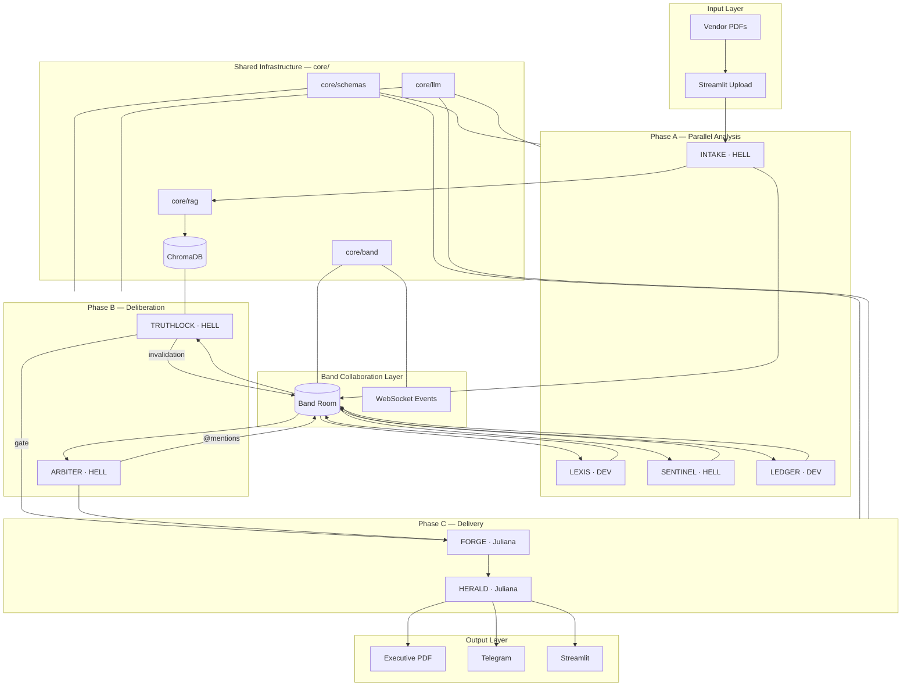
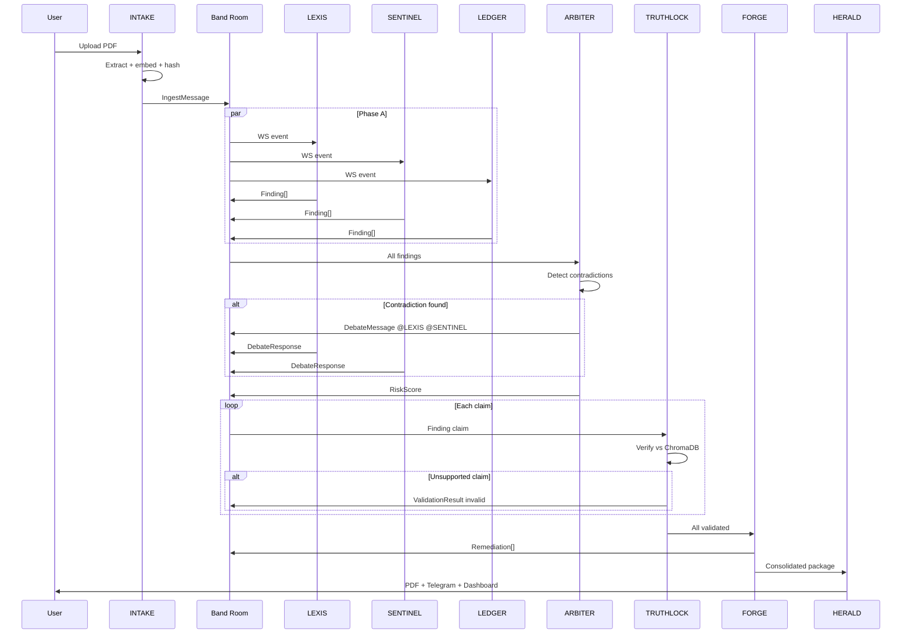

# VANGUARD — System Architecture

**Version:** 0.2 · **Hackathon:** Band of Agents · Lablab.ai

---

## Design principles

1. **Band is the system bus** — agents communicate only via Room messages, not direct calls.
2. **Schemas before agents** — all messages validate against `core/schemas/` before publish.
3. **TRUTHLOCK gates Phase C** — no remediation or executive output with pending invalidations.
4. **Single source of truth** — INTAKE hash + ChromaDB; agents never store document copies locally.
5. **Owner per agent** — one branch, one prompt, one pytest suite per External Agent.

---

## High-level architecture



---

## Message flow sequence



---

## Core modules

| Module | Path | Owner | Purpose |
|--------|------|-------|---------|
| Band client | `core/band/` | HELL | REST + WebSocket + mentions |
| RAG pipeline | `core/rag/` | DEV | PDF → chunks → embeddings → query |
| LLM clients | `core/llm/` | DEV + HELL | Featherless (DEV), AI/ML API (HELL) |
| Schemas | `core/schemas/` | DEV | Pydantic contracts for all messages |
| Session state | `core/schemas/session.py` | HELL | AuditSession phase machine |

---

## Schema catalog

| Model | Publisher | Consumers |
|-------|-----------|-----------|
| `IngestMessage` | INTAKE | LEXIS, SENTINEL, LEDGER, TRUTHLOCK |
| `Finding` | LEXIS, SENTINEL, LEDGER | ARBITER, TRUTHLOCK |
| `DebateMessage` | ARBITER | All Phase A agents |
| `DebateResponse` | LEXIS, SENTINEL, LEDGER | ARBITER |
| `RiskScore` | ARBITER | FORGE, HERALD, TRUTHLOCK |
| `ValidationResult` | TRUTHLOCK | ARBITER, FORGE (gate) |
| `Remediation` | FORGE | HERALD |
| `ExecutiveSummary` | HERALD | Streamlit, n8n, PDF |

---

## Technology decisions

| Decision | Choice | Rationale |
|----------|--------|-----------|
| Agent runtime | Band External Agents (Python SDK) | Hackathon requirement; deep integration |
| Primary LLM | Featherless Llama-3-8B-Instruct | Sponsor credits; speed |
| Reasoning LLM | AI/ML API | ARBITER + TRUTHLOCK need stronger reasoning |
| Vector store | ChromaDB local | Free, no cloud dependency for MVP |
| PDF extract | PyMuPDF | Fast, reliable text extraction |
| Orchestration UI | Streamlit | Python-native; quick deploy |
| Notifications | n8n self-hosted → Telegram | No custom integration code |
| Package manager | uv | Fast, lockfile reproducibility |

See also: `docs/adr/` for detailed decision records.

---

## Security notes (MVP)

- API keys in `.env` and `config/agent_config.yaml` — both gitignored
- No vendor PDFs committed to repo — `tests/documents/` uses public policies only
- Integrity hash on ingest prevents silent document tampering mid-audit

---

## Deployment topology (demo)

```
Local / Streamlit Cloud
├── 8 agent processes (scripts/run_agent.py)
├── ChromaDB (./data/chroma)
├── n8n Docker (localhost:5678)
└── Band Room (cloud — band.ai)

Streamlit Cloud ← HERALD dashboard
Telegram ← n8n webhook ← HERALD
```
