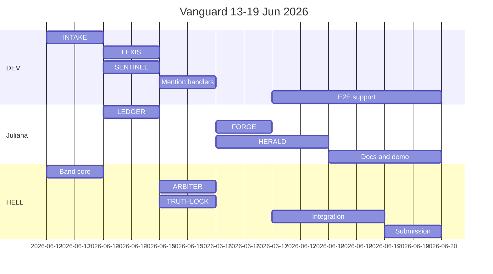

# Plan de gestión VANGUARD — 13 al 19 junio 2026

Documento maestro de gestión del sprint hackathon. Resumen ejecutivo en [README.md](../README.md).

---

## Contexto y punto de partida

**Estado actual (Day 0 parcial):** estructura de carpetas, `pyproject.toml`, `README.md`, `.env.example`, `config/agent_config.yaml.example`. Sin código de agentes ni `core/` implementado.

**Ventana de desarrollo:** 7 días calendario (**13/06 → 19/06/2026**), cierre Lablab.ai el **19/06**.

**Kick-off Band (12/06, 8:00 AM PDT):** el equipo arranca el 13/06; ver grabación del stream antes del standup de apertura.

---

## Equipo y reparto paralelo de agentes

Cada persona es **owner** de sus agentes (rama `agent/<nombre>`, prompt en `docs/prompts/`, tests en `tests/fixtures/`). Tareas transversales se reparten en bloques de mañana (sync) / tarde (deep work).

| Persona | Agentes (owner) | Responsabilidad transversal |
|---------|-----------------|------------------------------|
| **DEV** | INTAKE, LEXIS, SENTINEL | `core/rag/`, `core/schemas/`, `scripts/run_agent.py`, corpus LEXIS + señales SENTINEL |
| **Juliana** | LEDGER, FORGE, HERALD | `docs/prompts/`, `docs/reference/`, `dashboard/`, `integrations/` (n8n, Telegram), PDF ejecutivo |
| **HELL** | ARBITER, TRUTHLOCK | `core/band/`, `core/llm/`, Room Band, integración WebSocket, merge a `dev` |

**Bloque compartido (Días 5–7):** integración E2E, ajuste de prompts, README final, video, entrega Lablab — rotación diaria de **integration lead** (ver cronograma).

---

## Contratos compartidos (bloqueante Day 1 — tarde)

Antes de que los tres agentes de Fase A avancen en paralelo el Día 2, **DEV + HELL** deben cerrar en `core/schemas/`:

| Schema | Campos clave |
|--------|--------------|
| `IngestMessage` | texto segmentado, metadatos, `integrity_hash` |
| `Finding` | agent, severity, clause_ref, regulation, claim |
| `DebateMessage` | agents_involved, contradiction, status |
| `ValidationResult` | claim_id, supported, source_span |
| `AuditSessionState` | enum de fases del pipeline |

Esto evita divergencia entre los 3 tracks paralelos.

---

## Cronograma día a día

### Viernes 13/06 — Día 1: Band Room + INTAKE

**Meta del día:** PDF → PyMuPDF → ChromaDB → mensaje JSON en Room con hash; listeners pasivos confirman recepción por WebSocket.

| Horario | Actividad | Owner |
|---------|-----------|-------|
| 09:00–10:00 | Standup + revisión grabación kick-off Band | Todos |
| 10:00–13:00 | Crear Room Band, `core/band/` (REST + WebSocket), registrar 8 External Agents | HELL |
| 10:00–13:00 | `core/rag/` (PyMuPDF, ChromaDB, LangChain embeddings), borrador `IngestMessage` | DEV |
| 10:00–13:00 | Recolectar 3+ PDFs de prueba (Google Workspace / AWS / Azure) en `tests/documents/` | Juliana |
| 14:00–18:00 | Agente **INTAKE** completo + publicación en Room | DEV |
| 14:00–18:00 | `core/llm/` base (Featherless client) + listeners pasivos stub en LEXIS/SENTINEL/LEDGER | HELL |
| 14:00–18:00 | Prompt INTAKE en `docs/prompts/intake.md`, completar `.env` y `agent_config.yaml` | Juliana |
| 18:00–19:00 | Demo interna: cargar PDF, ver mensaje en Room, confirmar WebSocket | Todos |

**Definition of Done (DoD):**

- [ ] Mensaje INTAKE visible en Band Room con hash verificable
- [ ] ChromaDB persiste embeddings en `data/chroma/`
- [ ] Al menos 2 agentes listener reciben el evento por WebSocket

---

### Sábado 14/06 — Día 2: Análisis paralelo (LEXIS, SENTINEL, LEDGER)

**Meta del día:** los tres agentes responden al mensaje INTAKE y publican hallazgos estructurados.

| Owner | Entregables |
|-------|-------------|
| **DEV** | **LEXIS** + **SENTINEL** funcionales; corpus GDPR/ISO27001/SOC2 en `docs/reference/`; 50 señales SaaS en `docs/reference/sentinel_signals.txt` |
| **Juliana** | **LEDGER** funcional; prompts `lexis.md`, `sentinel.md`, `ledger.md` |
| **HELL** | Finalizar schemas `Finding`; utilidad publicar/leer mensajes Room; soporte LLM a DEV/Juliana |

**DoD:**

- [ ] 3 mensajes de hallazgos en Room tras un ingest
- [ ] Severidad (Critical / High / Medium / Low) en cada finding
- [ ] Referencia a sección del documento en cada claim

---

### Domingo 15/06 — Día 3: Debate (ARBITER + TRUTHLOCK) — día crítico

**Meta del día:** ciclo de debate con @mentions; TRUTHLOCK valida claims contra ChromaDB; gate bloquea si hay invalidaciones pendientes.

| Owner | Entregables |
|-------|-------------|
| **HELL** | **ARBITER** (contradicciones, sub-hilos, @mentions, Risk Score 0–100) |
| **HELL** | **TRUTHLOCK** (verificación semántica, alertas de invalidación) |
| **DEV** | Handlers de respuesta a @mentions en LEXIS y SENTINEL |
| **Juliana** | Handlers de @mentions en LEDGER; prompts `arbiter.md`, `truthlock.md` |

**DoD:**

- [ ] ARBITER abre debate ante contradicción real entre 2 agentes
- [ ] Agentes analíticos responden a @mention
- [ ] TRUTHLOCK invalida al menos 1 claim inventado en prueba controlada
- [ ] Fase C bloqueada mientras existan alertas TRUTHLOCK pendientes

**Contingencia:** si el debate activo no llega a tiempo, ARBITER resuelve con LLM de razonamiento (AI/ML API) pero **publica el hilo de debate en Room** igualmente.

---

### Lunes 16/06 — Día 4: Remediación y salida (FORGE + HERALD)

**Meta del día:** flujo punta a punta con Telegram + Score de Riesgo.

| Owner | Entregables |
|-------|-------------|
| **Juliana** | **FORGE** (mitigaciones accionables); **HERALD** (PDF reportlab/fpdf2, n8n → Telegram, Streamlit básico) |
| **DEV** | Schemas `Remediation`, `ExecutiveSummary`; prueba E2E INTAKE → HERALD |
| **HELL** | Gate TRUTHLOCK → FORGE; Risk Score final expuesto a HERALD |

**DoD:**

- [ ] FORGE genera cláusulas legales concretas por hallazgo Critical/High
- [ ] HERALD envía resumen 5 líneas a Telegram con Score
- [ ] Streamlit muestra auditoría activa con semáforo
- [ ] URL del Room Band incluida como evidencia de trazabilidad

**Contingencia PDF:** si reportlab es pobre visualmente → weasyprint (HTML → PDF).

---

### Martes 17/06 — Día 5: Integración, pruebas y prompts

**Integration lead:** DEV

**Meta del día:** 3 perfiles de documento probados; log de ajustes en Notion.

| Perfil | Documento | Qué validar |
|--------|-----------|-------------|
| Bajo riesgo | Política cloud estándar | Score bajo, pocos hallazgos |
| Riesgo medio | Contrato SaaS incompleto | Debate parcial, score medio |
| Alto riesgo | Sin GDPR, jurisdicción vaga, sin SLA | ARBITER debate, FORGE remedia, TRUTHLOCK activo |

**Todos:** ejecutar flujo completo ×3; registrar fallos de prompt y fixes en Notion (Prompt Log + Decision Log).

**DoD:**

- [ ] 3/3 flujos completos sin crash
- [ ] TRUTHLOCK: 0 alucinaciones no detectadas en perfil alto riesgo
- [ ] Notion actualizado con bitácora

---

### Miércoles 18/06 — Día 6: Pulido, documentación y video

**Integration lead:** Juliana

| Bloque | Owner | Entregables |
|--------|-------|-------------|
| Refactor + lint | DEV | Código limpio, merge `dev` → `main` |
| README + plan | Juliana | README ampliado (setup, `.env`, outputs esperados) |
| Video + slides | HELL + Juliana | Guion 5 actos (problema 30s, solución 30s, demo 2min, arquitectura 30s, negocio 30s) |

**DoD:**

- [ ] README con comandos `uv run python scripts/run_agent.py <agent>`
- [ ] Video grabado (3–5 min)
- [ ] Slides + imagen de portada Lablab

---

### Jueves 19/06 — Día 7: Entrega final

**Integration lead:** HELL

#### Checklist Lablab.ai

| Entregable | Valor |
|------------|-------|
| Título | Vanguard |
| Descripción corta (≤140 chars) | Multi-agent AI system that automates third-party vendor compliance audits for law firms using Band's collaborative debate infrastructure |
| Tags | Band, Featherless AI, AI/ML API, Python, RAG, LangChain, ChromaDB, Streamlit |
| Repo GitHub | Público, código limpio en `main` |
| Demo | Streamlit Cloud URL |
| Video + slides + cover | Subidos |

**DoD:** submission completa en Lablab.ai + smoke test final en producción.

---

## Extras recomendados

Priorizar solo si el DoD del día ya está verde:

1. `docker/docker-compose.yml` — n8n self-hosted (Juliana, Día 4)
2. `core/schemas/session.py` — máquina de estados `AuditSession` (HELL, Día 3)
3. `tests/fixtures/` — mocks de mensajes Room para pytest (DEV, Día 5)
4. Deploy Streamlit Cloud (Juliana, Día 6)
5. Fallback Ollama en `core/llm/` (HELL, Día 5 si créditos Featherless bajan)

---

## Riesgos y contingencias

| Riesgo | Probabilidad | Impacto | Mitigación | Owner |
|--------|-------------|---------|------------|-------|
| Debate ARBITER demasiado complejo | Alta | Crítico | Versión simplificada con resolución LLM + publicación en Room | HELL |
| Créditos Featherless agotados | Media | Alto | Ollama local para LEXIS/LEDGER; reservar créditos para ARBITER/TRUTHLOCK | HELL |
| PDF ejecutivo pobre | Media | Medio | weasyprint HTML → PDF | Juliana |
| Schemas divergentes entre agentes | Media | Alto | Bloque sync Día 1 tarde; PR review obligatorio a `dev` | DEV + HELL |
| 3 personas, 8 agentes, 7 días | Alta | Alto | Reparto paralelo estricto; standup 09:00; no reasignar agentes mid-sprint | Todos |

---

## Ventajas competitivas (pitch — Día 6)

1. **Band estructural** — debate con @mentions verificable en historial del Room
2. **TRUTHLOCK** — anti-alucinación en tiempo real contra documento fuente
3. **8 roles memorables** + 3 fases explicables en menos de 60 segundos
4. **TPRM legal** — dolor real (40–120 h/auditoría) con demo E2E

*Modelo de negocio: incluir en guion de video / Notion, no en README principal.*

---

## Ritual diario del equipo

| Hora | Ritual | Duración |
|------|--------|----------|
| 09:00 | Standup — DoD ayer, plan hoy, blockers | 15 min |
| 13:00 | Sync técnica — schemas, Room, merge conflicts | 15 min |
| 18:00 | Demo del día — mostrar DoD en Band Room | 30 min |

**Flujo Git:** `agent/<nombre>` → PR a `dev` → merge diario → `main` el Día 6.

---

## Criterio de éxito del sprint

El sprint es exitoso si el **19/06 a las 18:00** se cumple:

1. Flujo E2E demostrable en video (PDF → Room → debate → TRUTHLOCK → Telegram + Streamlit)
2. 8 agentes registrados y funcionales en Band
3. Repositorio público con README instalable
4. Submission Lablab.ai completa
