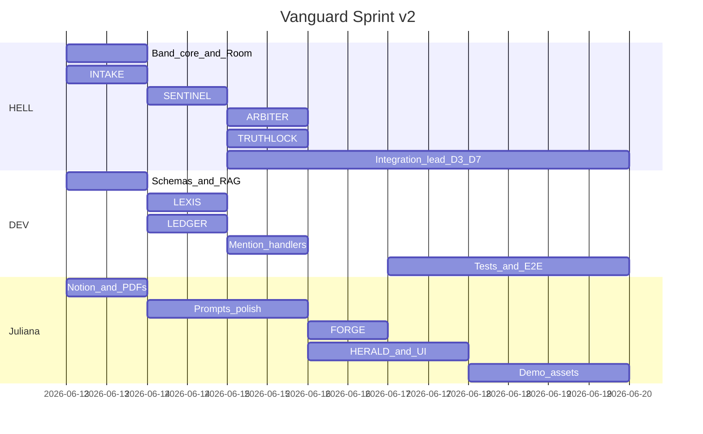

# Plan de gestión VANGUARD — 13 al 19 junio 2026

**Versión:** 2.0 · **Evento:** Band of Agents · Lablab.ai  
**Equipo INZERM:** DEV · Juliana · HELL

Documentos relacionados:

| Documento | Contenido |
|-----------|-----------|
| [TEAM_CHARTER.md](TEAM_CHARTER.md) | Ownership, RACI, 15+ tareas por persona |
| [ARCHITECTURE.md](ARCHITECTURE.md) | Diagramas, schemas, decisiones técnicas |
| [LABLAB_SUBMISSION.md](LABLAB_SUBMISSION.md) | Checklist de entrega |
| [DEMO_SCRIPT.md](DEMO_SCRIPT.md) | Guion de video |
| [CONTRIBUTING.md](../CONTRIBUTING.md) | Git workflow, PR standards |
| [adr/](adr/) | Architecture Decision Records |

---

## Resumen ejecutivo

VANGUARD automatiza auditorías TPRM de proveedores tecnológicos para firmas legales mediante **8 agentes External** en un **Band Room**. El sprint de 7 días (13–19/06/2026) entrega un MVP demostrable con debate estructurado, verificación anti-alucinación (TRUTHLOCK) y reporte ejecutivo vía HERALD.

**Criterio de éxito:** flujo E2E en video · 8 agentes en Band · repo público · submission Lablab completa el **19/06 18:00**.

---

## Ownership de agentes (v2)

| Persona | Agentes | Count | Foco transversal |
|---------|---------|-------|------------------|
| **HELL** | INTAKE, SENTINEL, ARBITER, TRUTHLOCK | **4** | `core/band/`, Room, debate, verificación, tech lead |
| **DEV** | LEXIS, LEDGER | 2 | `core/rag/`, `core/schemas/`, `core/llm/`, tests |
| **Juliana** | FORGE, HERALD | 2 | `dashboard/`, `integrations/`, prompts, demo Lablab |

---

## Fase 0 — Pre-sprint (completar antes del 13/06)

| ID | Tarea | Owner | Estado |
|----|-------|-------|--------|
| P0-1 | Estructura repo + `uv` environment | Todos | Done |
| P0-2 | Cuenta band.ai + crear team workspace | HELL | [ ] |
| P0-3 | Registrar 8 External Agents; export UUIDs | HELL | [ ] |
| P0-4 | Cuenta Featherless AI — activar créditos | DEV | [ ] |
| P0-5 | Cuenta AI/ML API — activar créditos | HELL | [ ] |
| P0-6 | ChromaDB: `uv add chromadb langchain pymupdf` + smoke test | DEV | [ ] |
| P0-7 | Docker + n8n compose (`docker/docker-compose.yml`) | Juliana | [ ] |
| P0-8 | Notion workspace (5 secciones) | Juliana | [ ] |
| P0-9 | Telegram bot + chat ID para HERALD | Juliana | [ ] |
| P0-10 | Ver grabación kick-off Band (12/06) | Todos | [ ] |
| P0-11 | Branch `dev` creada desde `main` | HELL | [ ] |
| P0-12 | `.env` + `agent_config.yaml` locales completos | Juliana | [ ] |

---

## Workstreams transversales

| Stream | Lead | Entregables sprint |
|--------|------|-------------------|
| **Engineering** | HELL | 8 agentes + core/ |
| **Platform** | DEV | schemas, rag, llm, scripts, pytest |
| **Product** | Juliana | Streamlit, PDF, Telegram, prompts |
| **QA** | DEV (D5) | 3 perfiles documento + E2E tests |
| **DevOps** | Juliana | Docker n8n, Streamlit Cloud |
| **Documentation** | Juliana (D6) | README, architecture, submission pack |
| **Demo & pitch** | Juliana + HELL | Video, slides, cover image |

---

## Bloqueante crítico — Schemas (Día 1, 14:00)

**DEV + HELL** congelan `core/schemas/` antes de implementación paralela:

| Model | Owner implementación | Owner review |
|-------|---------------------|--------------|
| `IngestMessage` | DEV | HELL |
| `Finding` | DEV | HELL |
| `DebateMessage` / `DebateResponse` | DEV | HELL |
| `RiskScore` | DEV | HELL |
| `ValidationResult` | DEV | HELL |
| `Remediation` | DEV | Juliana |
| `ExecutiveSummary` | DEV | Juliana |
| `AuditSessionState` | HELL | DEV |

---

## Día 1 — Viernes 13/06 · Band Room + INTAKE

**Meta:** PDF → ChromaDB → IngestMessage en Room · listeners confirman WebSocket  
**Integration lead:** HELL

### HELL (4 bloques)

| ID | Tarea | Horas |
|----|-------|-------|
| H-D1-01 | Crear Band Room (debate estructurado habilitado) | 1h |
| H-D1-02 | Implementar `core/band/client.py` — auth, publish, subscribe | 3h |
| H-D1-03 | Implementar `core/band/websocket.py` — event listener | 2h |
| H-D1-04 | Registrar y verificar 8 External Agents | 1h |
| H-D1-05 | Agente **INTAKE**: PyMuPDF → segment → hash → ChromaDB → publish | 3h |
| H-D1-06 | Listeners stub pasivos en LEXIS/SENTINEL/LEDGER (log only) | 1h |
| H-D1-07 | PR `agent/intake` + `feat/band-core` → `dev` | 0.5h |

### DEV (4 bloques)

| ID | Tarea | Horas |
|----|-------|-------|
| D-D1-01 | `uv add pydantic chromadb langchain pymupdf` | 0.5h |
| D-D1-02 | `core/rag/extractor.py` — PDF text + sections | 2h |
| D-D1-03 | `core/rag/embeddings.py` — LangChain + ChromaDB | 2h |
| D-D1-04 | `core/schemas/messages.py` — IngestMessage draft | 2h |
| D-D1-05 | `core/llm/featherless_client.py` — OpenAI-compatible client | 1.5h |
| D-D1-06 | Review PR HELL — schemas alignment | 1h |
| D-D1-07 | Test unitario: extract + embed sample PDF | 1h |

### Juliana (4 bloques)

| ID | Tarea | Horas |
|----|-------|-------|
| J-D1-01 | Notion: APIs, Prompts, ADR, Prompt Log, Bitácora | 1.5h |
| J-D1-02 | Descargar 5 PDFs → `tests/documents/` | 1.5h |
| J-D1-03 | Completar `.env` + `agent_config.yaml` | 1h |
| J-D1-04 | Pulir `docs/prompts/intake.md` | 0.5h |
| J-D1-05 | `docker compose up` — verificar n8n en :5678 | 1h |
| J-D1-06 | Crear Telegram bot; guardar token en `.env` | 1h |
| J-D1-07 | Documentar credenciales en Notion (redacted) | 0.5h |
| J-D1-08 | Asistir demo 18:00 — captura screenshot Room | 0.5h |

**DoD Día 1:** IngestMessage en Room · hash verificable · ChromaDB persist · 2+ listeners WS · PRs merged

---

## Día 2 — Sábado 14/06 · Análisis paralelo

**Meta:** LEXIS + SENTINEL + LEDGER publican Finding[] tras ingest  
**Integration lead:** DEV

### HELL

| ID | Tarea | Horas |
|----|-------|-------|
| H-D2-01 | Agente **SENTINEL** — análisis + cross-ref `sentinel_signals.txt` | 4h |
| H-D2-02 | Finalizar `core/band/mentions.py` — parse @AGENT | 2h |
| H-D2-03 | Code review PRs DEV (LEXIS, LEDGER) | 1h |
| H-D2-04 | Documentar ADR-001 en `docs/adr/` | 0.5h |
| H-D2-05 | Test SENTINEL: publish Finding con clause_ref | 1h |

### DEV

| ID | Tarea | Horas |
|----|-------|-------|
| D-D2-01 | Agente **LEXIS** — RAG sobre `docs/reference/` + Featherless | 4h |
| D-D2-02 | Agente **LEDGER** — análisis financiero + Featherless | 3h |
| D-D2-03 | Expandir corpus GDPR/ISO/SOC2 (no stubs) | 2h |
| D-D2-04 | `core/schemas/findings.py` — Finding + Severity enum | 1h |
| D-D2-05 | pytest: LEXIS returns valid Finding schema | 1h |

### Juliana

| ID | Tarea | Horas |
|----|-------|-------|
| J-D2-01 | Pulir prompts: lexis, sentinel, ledger | 2h |
| J-D2-02 | Validar outputs con equipo — Prompt Review 13:00 | 1h |
| J-D2-03 | Crear contrato SaaS sintético alto riesgo (PDF/texto) | 2h |
| J-D2-04 | Esqueleto `dashboard/app.py` — placeholder | 1h |
| J-D2-05 | Notion Prompt Log — versión v1 de cada prompt Fase A | 1h |
| J-D2-06 | Demo 18:00 — capturar 3 Finding messages en Room | 0.5h |

**DoD Día 2:** 3 Finding messages · severidad en cada uno · clause_ref presente · corpus expandido

---

## Día 3 — Domingo 15/06 · Debate (día crítico)

**Meta:** ARBITER debate · TRUTHLOCK gate · @mention handlers  
**Integration lead:** HELL

### HELL

| ID | Tarea | Horas |
|----|-------|-------|
| H-D3-01 | Agente **ARBITER** — detect contradictions, Risk Score | 4h |
| H-D3-02 | Agente **TRUTHLOCK** — ChromaDB verify + invalidation | 4h |
| H-D3-03 | `core/schemas/session.py` — AuditSession state machine | 2h |
| H-D3-04 | `core/llm/aiml_client.py` — AI/ML API for reasoning | 1.5h |
| H-D3-05 | SENTINEL @mention handler (respuesta en debate) | 1h |
| H-D3-06 | ADR-002 truthlock gate | 0.5h |
| H-D3-07 | Prueba controlada: claim inventado → invalidation | 1h |

### DEV

| ID | Tarea | Horas |
|----|-------|-------|
| D-D3-01 | LEXIS @mention handler | 2h |
| D-D3-02 | LEDGER @mention handler | 2h |
| D-D3-03 | `tests/fixtures/debate_thread.json` mock | 1h |
| D-D3-04 | Integration test: contradiction triggers DebateMessage | 2h |
| D-D3-05 | Soporte HELL en aiml_client si bloqueado | 1h |

### Juliana

| ID | Tarea | Horas |
|----|-------|-------|
| J-D3-01 | Pulir prompts arbiter, truthlock | 2h |
| J-D3-02 | Preparar doc con contradicción inducida (lexis vs sentinel) | 1.5h |
| J-D3-03 | Documentar flujo debate en Notion con screenshots | 1h |
| J-D3-04 | Review UX: cómo se verá debate en demo video | 1h |
| J-D3-05 | Demo 18:00 — debate + invalidation en vivo | 1h |

**DoD Día 3:** DebateMessage publicado · agentes responden @mention · 1 invalidation · Phase C blocked

**Contingencia:** ARBITER resuelve con LLM sin respuesta activa; debate thread igual en Room.

---

## Día 4 — Lunes 16/06 · Remediación y entrega

**Meta:** FORGE + HERALD · Telegram · Streamlit · PDF  
**Integration lead:** Juliana

### HELL

| ID | Tarea | Horas |
|----|-------|-------|
| H-D4-01 | Gate TRUTHLOCK → FORGE en session state | 2h |
| H-D4-02 | Exponer RiskScore payload estandarizado a HERALD | 1h |
| H-D4-03 | Code review FORGE + HERALD PRs | 1.5h |
| H-D4-04 | E2E run con Juliana — debug Band issues | 2h |
| H-D4-05 | Captura video B-roll: Room + TRUTHLOCK | 1h |

### DEV

| ID | Tarea | Horas |
|----|-------|-------|
| D-D4-01 | Schemas Remediation + ExecutiveSummary | 1.5h |
| D-D4-02 | `scripts/run_pipeline.py` — orchestrator local | 3h |
| D-D4-03 | E2E test stub: ingest → risk score (no herald yet) | 2h |
| D-D4-04 | Fix integration bugs from pipeline run | 2h |

### Juliana

| ID | Tarea | Horas |
|----|-------|-------|
| J-D4-01 | Agente **FORGE** — mitigaciones Critical/High | 3h |
| J-D4-02 | Agente **HERALD** — compose ExecutiveSummary | 2h |
| J-D4-03 | `integrations/pdf_generator.py` — reportlab template | 2h |
| J-D4-04 | n8n workflow: webhook → Telegram | 2h |
| J-D4-05 | `dashboard/app.py` — sessions, score, semáforo | 2h |
| J-D4-06 | Demo 18:00 — Telegram recibe Score | 0.5h |

**DoD Día 4:** Cláusulas FORGE · Telegram 5 líneas · Streamlit live · PDF generado · Room URL en report

---

## Día 5 — Martes 17/06 · Integración y QA

**Integration lead:** DEV

### Matriz de prueba

| ID | Perfil | Documento | Owner test | Validaciones |
|----|--------|-----------|------------|--------------|
| T-01 | Bajo | Google/AWS privacy policy | DEV | Score <40, 0 Critical |
| T-02 | Medio | Contrato SaaS incompleto | Juliana | Debate parcial, 40–70 |
| T-03 | Alto | Contrato sintético sin GDPR | HELL | Debate + invalidation test |

### HELL

| ID | Tarea | Horas |
|----|-------|-------|
| H-D5-01 | Ejecutar T-03; fix ARBITER/TRUTHLOCK | 3h |
| H-D5-02 | Fallback Ollama stub si créditos bajos | 2h |
| H-D5-03 | Review 3 Room histories — evidencia judges | 1h |
| H-D5-04 | pytest e2e support | 2h |

### DEV

| ID | Tarea | Horas |
|----|-------|-------|
| D-D5-01 | Ejecutar T-01; fix LEXIS/LEDGER prompts | 3h |
| D-D5-02 | `tests/test_e2e.py` — 3 profiles automated | 3h |
| D-D5-03 | Notion Prompt Log — todos los fixes | 1h |
| D-D5-04 | Performance: ingest <60s for 50-page PDF | 1h |

### Juliana

| ID | Tarea | Horas |
|----|-------|-------|
| J-D5-01 | Ejecutar T-02; fix FORGE/HERALD | 3h |
| J-D5-02 | weasyprint contingency if PDF ugly | 2h |
| J-D5-03 | Streamlit Cloud deploy | 1.5h |
| J-D5-04 | Notion Decision Log — design choices | 1h |

**DoD Día 5:** 3/3 E2E green · 0 undetected hallucinations T-03 · Notion complete

---

## Día 6 — Miércoles 18/06 · Pulido y demo

**Integration lead:** Juliana

### HELL

| ID | Tarea | Horas |
|----|-------|-------|
| H-D6-01 | Refactor band + arbiter + truthlock | 2h |
| H-D6-02 | Grabar demo Band Room (B-roll) | 2h |
| H-D6-03 | Slides act 4 — architecture | 1h |
| H-D6-04 | Code review final PRs | 2h |

### DEV

| ID | Tarea | Horas |
|----|-------|-------|
| D-D6-01 | Ruff/format entire codebase | 1.5h |
| D-D6-02 | Merge `dev` → `main` | 1h |
| D-D6-03 | `scripts/run_agent.py` final + README commands | 2h |
| D-D6-04 | Verify fresh clone install works | 1.5h |

### Juliana

| ID | Tarea | Horas |
|----|-------|-------|
| J-D6-01 | README final — setup, env, outputs, links | 2h |
| J-D6-02 | Video edit — 5 acts per DEMO_SCRIPT | 3h |
| J-D6-03 | Cover image 1280×720 | 1h |
| J-D6-04 | Slides acts 1–3, 5 | 2h |

**DoD Día 6:** Video 3–5 min · slides · cover · README complete · `main` stable

---

## Día 7 — Jueves 19/06 · Entrega Lablab

**Integration lead:** HELL · **Submission owner:** Juliana

| Hora | Actividad | Owner |
|------|-----------|-------|
| 08:00–10:00 | Smoke test completo (ver LABLAB_SUBMISSION.md) | DEV |
| 10:00–11:00 | Fix blockers P0 | HELL + DEV |
| 11:00–13:00 | Upload Lablab form — all fields | Juliana |
| 13:00–14:00 | Team review submission preview | Todos |
| 14:00–16:00 | Buffer: re-upload video/slides if rejected | Juliana |
| 16:00–18:00 | Final smoke on Streamlit Cloud · celebrate | Todos |

**DoD Día 7:** Lablab submission complete · smoke test green · GitHub public

---

## Riesgos ampliados

| ID | Riesgo | Prob | Impacto | Mitigación | Owner |
|----|--------|------|---------|------------|-------|
| R1 | Debate ARBITER complejo | Alta | Crítico | Simplified LLM resolve + Room thread | HELL |
| R2 | Featherless credits exhausted | Media | Alto | Ollama LEXIS/LEDGER; save AI/ML for B | DEV |
| R3 | PDF quality poor | Media | Medio | weasyprint fallback | Juliana |
| R4 | Schema drift | Media | Alto | D1 14:00 freeze; PR review | DEV+HELL |
| R5 | Band SDK API changes | Baja | Alto | Kick-off recording; Band discord | HELL |
| R6 | Streamlit deploy fail | Media | Medio | Local demo video backup | Juliana |
| R7 | n8n Telegram broken | Media | Medio | Direct Telegram API in HERALD | Juliana |
| R8 | 4 agents on HELL overload | Media | Alto | SENTINEL simplified to top-20 signals | HELL |
| R9 | No merge conflicts day 5 | Alta | Medio | Daily merge to dev mandatory | Todos |

---

## Ventajas competitivas (pitch)

1. **Band estructural** — @mentions + sub-hilos verificables
2. **TRUTHLOCK** — anti-alucinación en tiempo real
3. **8 roles + 3 fases** — explicable en 60 segundos
4. **TPRM legal** — dolor cuantificado con demo E2E
5. **Trazabilidad** — Room URL en reporte ejecutivo

---

## Rituales diarios

| Hora | Ritual | Participantes |
|------|--------|---------------|
| 09:00 | Standup — DoD ayer, plan hoy, blockers | Todos |
| 13:00 | Tech sync — schemas, merges, Band issues | Todos |
| 18:00 | Demo — DoD en Band Room | Todos |
| 21:00 | Async — Notion bitácora (opcional) | Owner del día |

---

## Métricas de progreso

Track daily in Notion:

| Métrica | Target D7 |
|---------|-------------|
| Agents functional | 8/8 |
| Schemas implemented | 8/8 |
| E2E profiles passing | 3/3 |
| Room messages in demo | 20+ |
| pytest passing | 100% |
| PRs merged to dev | 15+ |
| Video uploaded | 1 |
| Lablab fields complete | 100% |

---

## Criterio de éxito final

El **19/06 18:00** el sprint es exitoso si:

1. Video demuestra PDF → Room debate → TRUTHLOCK → Telegram + Streamlit
2. 8 External Agents operativos en Band
3. Repo público instalable en <15 min
4. Lablab.ai submission 100% completa
5. Cada integrante completó ≥15 tareas asignadas en [TEAM_CHARTER.md](TEAM_CHARTER.md)
